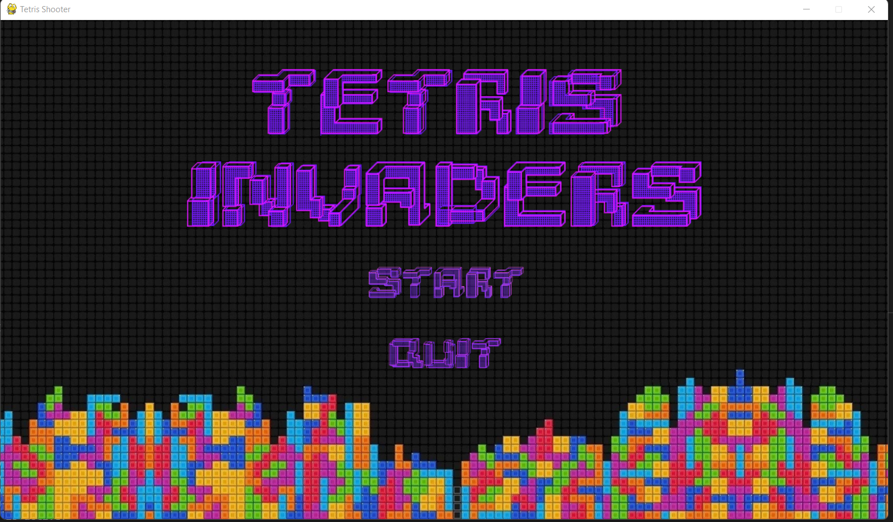
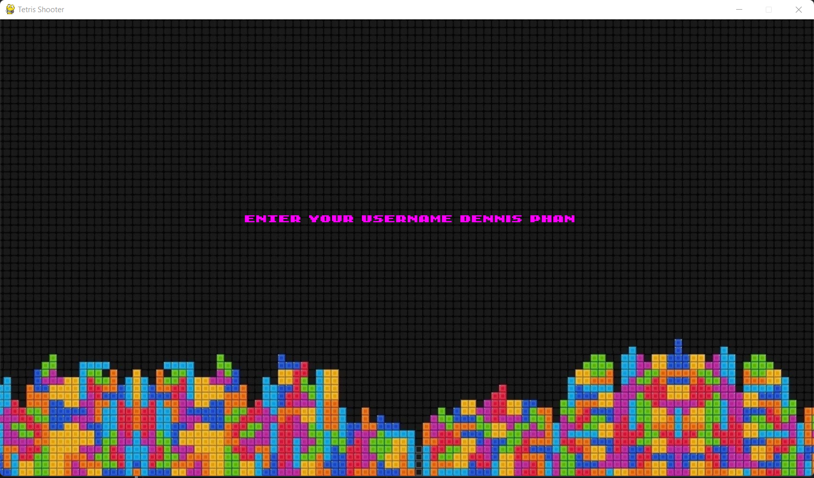
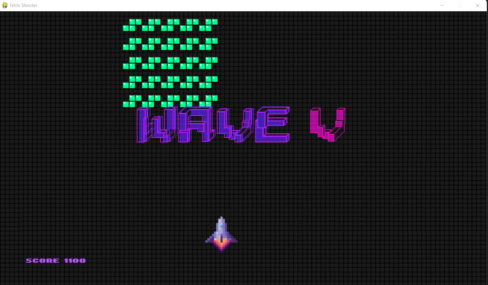
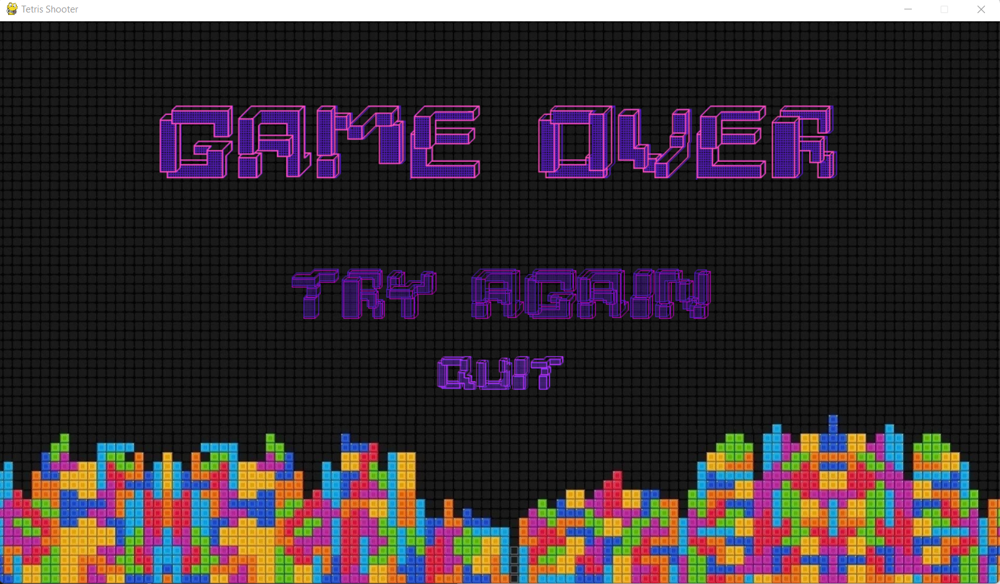
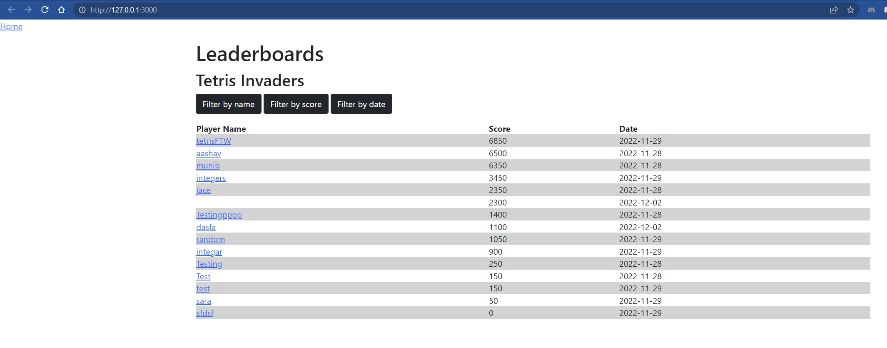
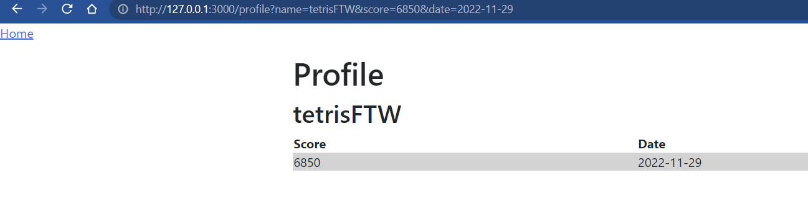

# ACIT2515 - Tetris Invaders
A pygame project based on Space Invaders because making tetris was too hard.

# Author
Dennis Phan

## Controls

Up, Down, Left, Right arrows moves the ship  
Space to shoot on the game screen  
Press 'p' to pause

## To run the game
run `python tetris_invaders.py` to check out the game  
run `python app.py` to check out the leaderboards

## Tutorial

### Welcome Screeen

You will enter the welcome screen shown below:

You can press `SPACE` or click the start button to enter the username screen  

You can press `ESC` or click no the quit button to exit the game.

### Username Screen

You can type your username here.  
Press `ENTER` to go to the game screen.

### Game Screen

If you enter your username fast enough.

There should be Waves 1 to 7 that spawn based on time.  
The text image 'Wave 1, Wave 2... etc' also blit on the screen based on time.
The sound effect along with it is also based on time.  
Currently there is a bug, as the time starts at the username screen.  

### Game Over

When a tetris block touches the bottom of the screen.  
The username is written into the json file along with the score and date you played.  
The leaderboards run on flask will pop up.  
You can click `try again` to play.  

### Leaderboards

Currently the filter buttons do not work.  

You can click a player's name and it will direct you to their profile.
It will query search for the stats attached to the player's name.  

